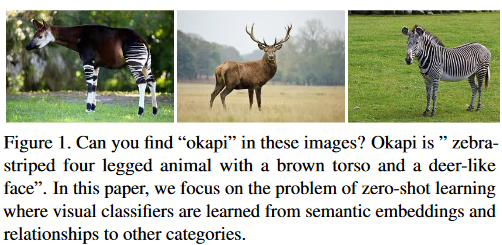

# Zero-shot Image Recognition using Convolutions and Knowledge Graphs

This project implements the method described in [Zero-shot Recognition via Semantic Embeddings and Knowledge Graphs](https://arxiv.org/pdf/1803.08035v2.pdf) and applies it to identifying different classes of snakes!

## Dependencies 
In order to run this project you must have first installed the following dependencies: 
- Python 3
- numpy
- matplotlib
- torch 
- torchvision 

## Problem Definition
Traditional Models (closed-world):
- new class → new data needed (usually lots), redo fine-tuning
- Models take a lot of time to fine-tune (assuming we even have the extra data) 
  
Solution: Zero-shot learning - Infer knowledge from past training
1. Implicit knowledge: learn vector representation of categories using text data → learn mapping connecting vector representation to visual classifier
2. Explicit knowledge: relations from KGs and using them as zero-shot classifiers

**Our task**: combine both implicit and explicit knowledge using a KG and GCN (following the method of [[Wang, Ye, and Gupta 2018]](https://arxiv.org/pdf/1803.08035v2.pdf)). Applying zero-shot approach to small/noisy/hard-to-learn dataset of snake images.

## Datasets
- ImageNet 2012 1k
- Snake dataset
- SnakeKG
  - a custom subset of [Wikidata](https://www.wikidata.org/)

## Methodology

### ResNet
ResNet is used for visual feature extraction as well as providing a baseline method for comparison. 

### Knowledge Graphs (KG)
The KG we use for our project is constructed as a subset of the [Wikidata knowledge graph](https://www.wikidata.org/). We use the [mapping from the ImageNet dataset to Wikidata entities](https://github.com/DominikFilipiak/imagenet-to-wikidata-mapping) created by [Filipiak, D., Fensel, A., & Filipowska, A.](https://www.tib-op.org/ojs/index.php/bis/article/view/65) to select the nodes from the ImageNet dataset. Wikidata identifiers for the 10 classes not in the ImageNet dataset are identified to include those nodes in the subgraph.   

### Graph Convolutional Networks (GCN)
To integrate the information from our KG as part of the classifications, this method employs a 6-layer GCN. 

## References 
While most of the referenced work is linked directly above, it is also more formally collected below: 
